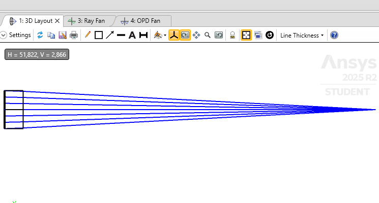

<i>Optical Design Portfolio — Zemax OpticStudio</i>

# Experiment 1: Single-Lens Focusing System — Spherical Aberration Characterization

| | |
|---|---|
| **Module** | Phase 1 — Ray Optics & Sequential Mode Foundation (Week 1) |
| **Software** | Ansys Zemax OpticStudio, Student Edition |
| **File(s)** | `week1_single_lens_focus.zos` |
| **Date** | August 2026 |
| **Author** | Dr. Parvathi Valsalan |

---

## 1. Aim / Objective

To design, build, and analyze a single-element (plano-convex) lens system in Zemax OpticStudio that focuses a collimated, on-axis input beam, and to quantitatively characterize the image quality of the resulting focal spot against the diffraction limit. A secondary objective is to experimentally verify, within the simulation, the theoretical cube-law dependence of third-order spherical aberration on aperture size by comparing two aperture configurations.

---

## 2. System Under Study

The system consists of a single plano-convex refractive lens (material: N-BK7) illuminated by a collimated, monochromatic on-axis beam, forming an image at the paraxial/marginal focus. The system was evaluated in two aperture configurations to isolate the contribution of spherical aberration.

**3D layout of the designed lens system:**

*Figure 1 — 3D Layout view from Zemax OpticStudio. Convex surface faces the incoming collimated beam; the flat back surface faces the image plane.*

| Parameter | Value |
|---|---|
| Sequential / Non-Sequential Mode | Sequential Mode |
| Aperture Type | Entrance Pupil Diameter (EPD) |
| Aperture values tested | 10 mm (wide) and 4 mm (stopped-down) |
| Units | Millimeters (mm) |
| Wavelength | 0.532 µm (532 nm, single wavelength) |
| Field | On-axis (0°) point source at infinity |
| Lens material | N-BK7 (Schott catalog) |
| Object distance | Infinity (collimated input) |

---

## 3. Theory

### 3.1 Ray Tracing and Focusing

In sequential ray tracing, a fan of rays representing a collimated input beam is propagated through each optical surface in order, using Snell's law at each interface. For an ideal (paraxial) lens, all rays parallel to the optical axis converge to a single point at the back focal distance. Real lenses deviate from this ideal behavior due to aberrations — most significantly, for a single simple lens at moderate aperture, **third-order spherical aberration**.

### 3.2 Spherical Aberration

Spherical aberration arises because marginal rays (passing through the outer zone of the lens) are refracted more strongly than paraxial rays (passing close to the optical axis), causing them to cross the optical axis closer to the lens. This produces a focal spot with finite size even under otherwise perfect alignment and fabrication. To third order, the transverse aberration contribution scales approximately with the cube of the marginal ray height (aperture radius):

> **RMS spot radius ∝ (aperture radius)³**

This scaling predicts that reducing the aperture diameter by a factor of 2.5 (10 mm → 4 mm) should reduce the aberration-driven spot size by approximately (2.5)³ ≈ 15.6×.

### 3.3 Diffraction Limit

Even a perfectly aberration-free lens cannot focus light to a mathematical point, due to diffraction. The radius of the first dark ring of the resulting Airy pattern is given by:

> **r(Airy) ≈ 1.22 × λ × (F/#)**

where λ is the wavelength and F/# is the focal ratio (focal length ÷ aperture diameter). This provides the theoretical performance floor against which the geometric (ray-trace) spot size is judged: a system is considered effectively diffraction-limited once its geometric RMS spot size falls well below the Airy radius.

---

## 4. Method

### 4.1 System Setup
- Opened a new Sequential Mode file in Zemax OpticStudio (Student Edition).
- Set Lens Units to Millimeters via System Explorer → Units.
- Set Aperture Type to Entrance Pupil Diameter, initial value 10 mm, via System Explorer → Aperture.
- Set a single system wavelength of 0.532 µm via System Explorer → Wavelengths.
- Confirmed a single on-axis field point (default) representing a collimated beam at infinity.

### 4.2 Lens Construction (Lens Data Editor)
- **OBJ surface:** thickness set to Infinity (collimated input).
- **Surface 1 (lens front):** positive radius of curvature, thickness ≈ 5 mm (center thickness), material set to N-BK7 (Schott catalog).
- **Surface 2 (lens back):** radius set to Infinity (plano surface), material left as air.
- **Final thickness** (Surface 2 → IMA) initially estimated, then refined using **Tools → Quick Focus** (equivalently, a Marginal Ray Height = 0 solve) to place the image plane at best focus.

### 4.3 Analysis Performed
- **3D Layout** (Analysis tab) — visual confirmation of ray convergence to a single focal point.
- **Spot Diagram** (Analysis → Rays & Spots) — RMS and geometric spot radius at the image plane.
- **Ray Fan / Ray Aberration plot** — transverse ray error vs. pupil position, to visualize aberration shape.
- **OPD Fan** — wavefront error across the pupil, in waves.

### 4.4 Aperture Comparison
The Entrance Pupil Diameter was then reduced from 10 mm to 4 mm (System Explorer → Aperture), the system was re-focused using Quick Focus, and the Spot Diagram analysis was repeated to isolate the effect of aperture size on aberration-driven spot size.

---

## 5. Results

| Configuration | EPD (mm) | F/# | RMS Spot Radius | Diffraction-Limited Airy Radius (approx.) |
|---|---|---|---|---|
| Wide aperture | 10 | ~9 | 9.032 µm | ~5.8 µm |
| Stopped-down aperture | 4 | ~22.5 | 0.575 µm | ~14.6 µm |

Ratio of RMS spot radius, wide aperture to stopped-down aperture: 9.032 µm / 0.575 µm ≈ **15.7×**, compared to the theoretical cube-law prediction of (10/4)³ ≈ **15.6×** — a close match.

*Figure 2 — Lens Data, 3D Layout, and Spot Diagram at 10 mm EPD (F/# ≈ 9).*

*Figure 3 — Lens Data, 3D Layout, and Spot Diagram at 4 mm EPD (F/# ≈ 22.5).*

---

## 6. Observations

- The 3D Layout showed a clean, single visual focus point for both aperture settings; the aberration was not visually apparent at this scale, despite being clearly present in the quantitative spot-size data.
- The Ray Fan plot showed a smooth, curved (non-flat) trace across the pupil, consistent with third-order spherical aberration rather than coma, astigmatism, or a flat (aberration-free) response.
- At the wide aperture (10 mm EPD, F/# ≈ 9), the geometric RMS spot radius (9.032 µm) exceeded the diffraction-limited Airy radius (≈ 5.8 µm), indicating the system was aberration-limited, not diffraction-limited.
- At the stopped-down aperture (4 mm EPD, F/# ≈ 22.5), the geometric RMS spot radius (0.575 µm) fell far below the corresponding Airy radius (≈ 14.6 µm), indicating the system became effectively diffraction-limited.

---

## 7. Inference

The close agreement between the observed spot-size reduction (≈15.7×) and the theoretical cube-law prediction (≈15.6×) confirms that third-order spherical aberration was the dominant image-quality limitation of the wide-aperture single-lens system, and that this aberration was successfully suppressed by stopping down the aperture. This exercise demonstrates, within a simulated environment, a trade-off routinely encountered on the optical bench: reducing aperture size improves image quality (smaller aberration-limited spot) at the direct cost of light-gathering power and ultimate diffraction-limited resolution (larger Airy disk at higher F/#). A well-specified optical system design must balance this trade-off against the application's actual throughput and resolution requirements, rather than defaulting to either extreme.

---

## 8. Future Aims / Next Steps

- Design and optimize a two-lens 4f relay system, and quantify sensitivity of image quality to inter-lens spacing (mechanical tolerance analogy to bench alignment).
- Introduce an achromatic doublet in place of the singlet and quantify the reduction in chromatic aberration across a multi-wavelength source.
- Use the Merit Function Editor to formally optimize lens curvatures/spacing against a target RMS spot size and total track length constraint, rather than relying on Quick Focus alone.
- Run a formal Tolerance Analysis (decenter, tilt, thickness) on this lens and compare sensitivity results to hands-on alignment intuition from bench-based optical work.
- Extend this single-element aberration study to an off-axis field point to additionally characterize coma and astigmatism, building toward full imaging-system field performance evaluation.
