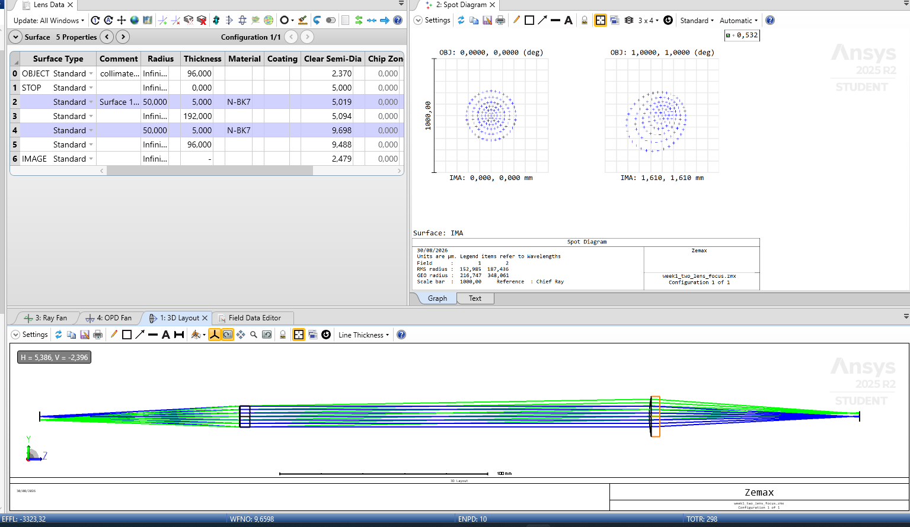
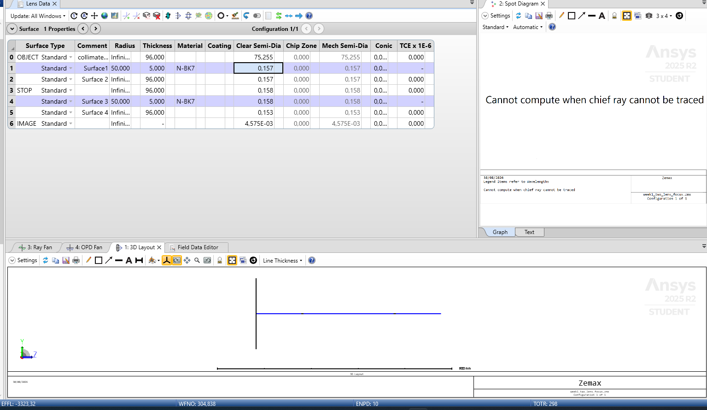
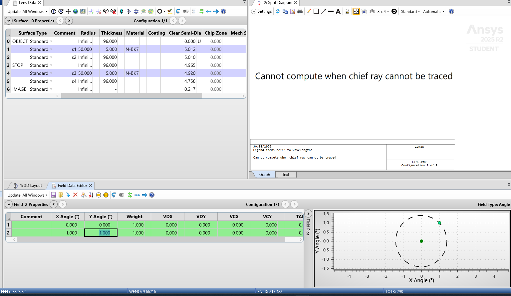
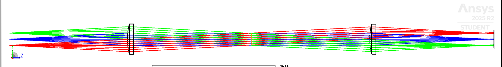
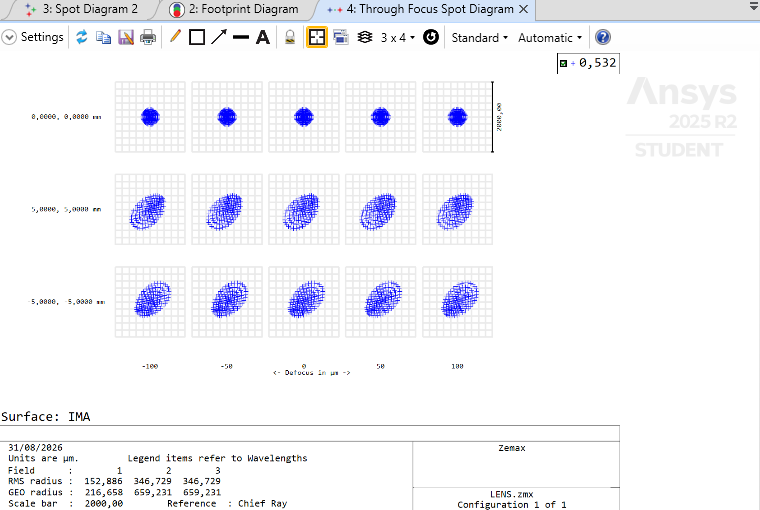

<i>Optical Design Portfolio — Zemax OpticStudio</i>

# Experiment 2: Two-Lens 4f Relay — Baseline Performance and Telecentric Stop Placement

| | |
|---|---|
| **Module** | Phase 1 — Ray Optics & Sequential Mode Foundation (Week 2) |
| **Software** | Ansys Zemax OpticStudio, Student Edition |
| **File(s)** | `week2_two_lens_4f_relay.zmx` |
| **Date** | August 2026 |
| **Author** | Dr. Parvathi Valsalan |

---

## 1. Aim / Objective

To design and analyze a two-lens **4f relay system** in Zemax OpticStudio — the geometry underlying Fourier-space and confocal imaging setups — using the same lens prescription characterized in Experiment 1. Specifically: (a) build and quantify the baseline relay's on-axis and off-axis image quality with the aperture stop at Lens 1, and (b) investigate the effect of relocating the aperture stop to the shared Fourier plane, the textbook 4f configuration intended to make the system telecentric.

---

## 2. System Under Study

Two identical plano-convex N-BK7 lenses (R = 50 mm, center thickness 5 mm — the same prescription characterized in Experiment 1, EFFL ≈ 96.25 mm), arranged so the object sits at Lens 1's front focal plane and the image forms at Lens 2's back focal plane, with the lenses separated by 2f (192 mm).

| Parameter | Value |
|---|---|
| Sequential / Non-Sequential Mode | Sequential Mode |
| Lens 1, Lens 2 | Plano-convex N-BK7, R = 50 mm, t = 5 mm (identical, reused from Experiment 1) |
| Object distance | 96 mm (≈ f, front focal plane of Lens 1) |
| Inter-lens spacing | 192 mm (≈ 2f) |
| Image distance | 96 mm (≈ f, back focal plane of Lens 2) |
| Wavelength | 0.532 µm (single wavelength) |
| Fields evaluated | On-axis, and one off-axis point |

Two configurations were built and compared:

- **Config A** — aperture stop at Lens 1 (simplest working arrangement)
- **Config B** — aperture stop relocated to the Fourier plane (midway through the 192 mm gap), the standard 4f arrangement intended to produce object-space telecentricity

---

## 3. Theory

### 3.1 The 4f Relay and the Fourier Plane

A point source placed at the front focal plane of a lens produces a collimated output beam, angled according to the point's off-axis position. In a 4f relay, this collimated beam travels to a second lens (separated by 2f), which reconverges it to a point at its own back focal plane. The plane exactly midway between the two lenses — where all field points' collimated bundles overlap — is the **Fourier plane**: every off-axis object point contributes light there, but spatially separated by angle rather than position, making it the natural location for spatial filtering or an aperture stop.

### 3.2 Telecentricity

A system is **telecentric** (in object space) when its entrance pupil is located at infinity, i.e., the chief ray for every field point travels parallel to the optical axis before reaching the first lens. This is achieved by placing the aperture stop at the shared back focal plane of the preceding element — exactly the Fourier plane in a 4f relay. The practical benefit is that image magnification becomes insensitive to small defocus errors, which is why telecentric relays are standard in metrology, confocal, and Fourier-imaging instrumentation.

### 3.3 Aperture Specification for Telecentric Systems

Standard "Entrance Pupil Diameter" aperture specification requires a finite, well-defined entrance pupil location. When a system is rendered object-space telecentric (pupil at infinity by design), this specification becomes degenerate. The appropriate alternative is to specify the aperture as a numerical aperture (**Object Space NA**), which remains well-defined regardless of pupil location.

### 3.4 Field Specification and Conjugate Distance

Zemax's "Angle" field type specifies field points by the angle at which a collimated bundle arrives — physically meaningful only when the object is at infinity. For a system with a finite-conjugate object (as here, object at 96 mm), field points must instead be specified as **Object Height** (a physical position at the object plane). Using Angle-type fields with a finite-conjugate object produces an ill-posed chief ray problem.

---

## 4. Method

### 4.1 Config A — Baseline Relay (Stop at Lens 1)

- Duplicated the Experiment 1 file; changed OBJECT thickness from Infinity to 96 mm.
- Retained the existing N-BK7 lens (R = 50, t = 5) as Lens 1, with the STOP surface at this lens (default/unmodified).
- Set the gap after Lens 1 to 192 mm.
- Inserted a second, identical N-BK7 lens (R = 50, t = 5) as Lens 2.
- Set the final thickness (Lens 2 → IMA) to 96 mm.
- Aperture Type: Entrance Pupil Diameter, value 10 mm (unchanged from Experiment 1).
- Field Type: Angle; Field 1 = (0°, 0°), Field 2 = (1°, 1°).
- Ran Spot Diagram at the image plane for both fields.

### 4.2 Config B — Stop at the Fourier Plane

- Split the 192 mm inter-lens gap into two 96 mm segments, inserting a new surface at the midpoint.
- Moved the STOP designation to this new mid-gap surface.
- **First attempt** retained Aperture Type = Entrance Pupil Diameter (10 mm) and Field Type = Angle — this failed (see Results, 5.2).
- **Second attempt**: changed Aperture Type to **Object Space NA**, value 0.052 (equivalent to the original 10 mm EPD at a 96 mm object distance) — resolved the aperture-related failure but exposed a second failure (see Results, 5.2).
- **Third attempt**: changed Field Type from Angle to **Object Height**, re-specifying Field 2 as (1 mm, 1 mm) rather than (1°, 1°) — resolved the chief-ray trace failure.
- Re-ran 3D Layout and Spot Diagram after each change to isolate which fix addressed which symptom.

---

## 5. Results

### 5.1 Config A — Baseline Relay (working on first attempt)

| Field | Field definition | RMS Spot Radius | GEO Spot Radius | Image height |
|---|---|---|---|---|
| Field 1 | 0°, 0° (on-axis) | 152.985 µm | 216.747 µm | 0.000, 0.000 mm |
| Field 2 | 1°, 1° (off-axis) | 187.436 µm | 348.061 µm | 1.610, 1.610 mm |

*Figure 1 — Config A (stop at Lens 1). On-axis and 1° off-axis spot diagrams, plus the 3D Layout showing both field bundles crossing at the shared waist between the lenses.*

For reference, Experiment 1's single-lens RMS spot radius (10 mm EPD, on-axis) was 9.032 µm — the two-lens relay's on-axis RMS (152.985 µm) is roughly 17× larger, consistent with the accumulated spherical aberration of two lenses in series plus additional pupil aberration from the relay geometry itself.

### 5.2 Config B — Stop at Fourier Plane: Two Failures, Then Success

**Failure 1 — Aperture Type incompatible with telecentric geometry:**

With the stop moved but Aperture Type still set to Entrance Pupil Diameter, the system produced non-physical clear semi-diameters (75.255 mm at the object surface; 0.157–0.158 mm at the lens surfaces) and the Spot Diagram returned "Cannot compute when chief ray cannot be traced" for the off-axis field.

*Figure 2 — Failure mode 1: Entrance Pupil Diameter aperture type produces degenerate clear semi-diameters once the stop is at the Fourier plane, because this geometry is object-space telecentric (entrance pupil at infinity).*

**Fix 1:** Aperture Type changed to Object Space NA (value 0.052). This produced realistic clear semi-diameters (approx. 4.7–5.0 mm at all working surfaces) and resolved the on-axis trace.

**Failure 2 — Field Type incompatible with finite object conjugate:**

Even after fixing the aperture, the off-axis field still failed with the same "chief ray cannot be traced" error.

*Figure 3 — Failure mode 2: Field Type = Angle degenerates harmlessly for the on-axis (0°,0°) field but is physically ill-defined for the off-axis field, because the object is at a finite distance (96 mm), not infinity.*

**Fix 2:** Field Type changed from Angle to Object Height; Field 2 re-specified as (1 mm, 1 mm).

**Result after both fixes:** the 3D Layout produced the expected 4f "bowtie" — on-axis and off-axis ray bundles crossing cleanly through a single shared point at the Fourier plane before re-diverging to the image plane.

*Figure 4 — Corrected Config B, 3D Layout, extended to three fields (0,0 / 5,5 / −5,−5 mm object height) for a fuller, symmetric view. All three bundles cross cleanly through the shared Fourier plane before re-diverging to the image plane.*

### 5.3 Config B — Quantitative Results and Through-Focus Behavior

With both fixes in place (Object Space NA aperture, Object Height fields), a third field was added at (−5, −5) mm to obtain a symmetric three-field picture, matching the standard textbook illustration of a 4f relay.

| Field | Field definition | RMS Spot Radius | GEO Spot Radius |
|---|---|---|---|
| Field 1 | 0, 0 mm (on-axis) | 152.886 µm | 216.658 µm |
| Field 2 | 5, 5 mm (off-axis) | 346.729 µm | 659.231 µm |
| Field 3 | −5, −5 mm (off-axis) | 346.729 µm | 659.231 µm |

Field 2 and Field 3 match exactly, as expected from the system's symmetry about the axis.

Compared to Config A (on-axis RMS 152.985 µm), Config B's on-axis RMS (152.886 µm) is essentially unchanged — telecentricity is a pupil-location property, not an aberration-correction technique, so it was never expected to reduce on-axis spot size. The relevant comparison is instead how spot size and shape behave **away from best focus**, which a Through-Focus Spot Diagram makes directly visible:

*Figure 5 — Through-Focus Spot Diagram, all three fields, defocus swept from −100 µm to +100 µm. Each field's spot changes only mildly in size across the sweep, with no shift in centroid position — the qualitative signature of telecentric imaging: defocus blurs the spot but does not shift or rescale it the way it would in a non-telecentric system.*

This is the clearest evidence yet that Config B is behaving as intended: the defining benefit of telecentricity isn't a smaller spot, it's **consistent spot position and shape under defocus**, which is exactly what Figure 5 shows.

---

## 6. Observations

- Config A worked correctly on the first attempt; both failure modes arose only after intentionally relocating the stop to test telecentricity — a direct consequence of the geometry change, not a modeling error.
- Both failures were **solver refusals**, not silently wrong answers: Zemax declined to compute a chief ray rather than returning a plausible-but-incorrect spot size in either failure case. This is a materially different failure mode than most hands-on lab equipment, where an error more often manifests as a subtly wrong reading rather than an outright refusal.
- The two failures were independent of each other: fixing the aperture type (Failure 1) did not resolve the field-type issue (Failure 2), and each required its own distinct diagnosis.
- The on-axis field (0°, 0° or equivalently 0, 0 mm) traced successfully under every configuration tested, because it is the one case where Angle-type and Object-Height-type field specifications coincide trivially (both reduce to "no offset"). This masked the Field Type problem until the off-axis field was tested — a reminder that on-axis-only validation can hide errors that only appear off-axis.

---

## 7. Inference

Relocating the aperture stop from Lens 1 to the shared Fourier plane is the textbook step to render a 4f relay object-space telecentric, but doing so changes the system's paraxial character in ways that invalidate aperture and field specifications that were valid for the non-telecentric baseline (Config A). Specifically: (1) once the entrance pupil moves to infinity, aperture size must be specified as a numerical aperture rather than a physical diameter, and (2) once the relevant conjugate is treated as effectively infinite in angle-space while the object itself remains at a finite physical distance, field points must be specified by physical height rather than angle. Both corrections were required simultaneously; neither alone was sufficient. This suggests a general lesson for future system modifications: changing pupil or conjugate geometry (moving a stop, changing an object distance, converting a finite system to afocal) should prompt an explicit review of both the aperture specification and the field specification, not just the surface data.

---

## 8. Future Aims / Next Steps

- Run the planned mis-spacing sensitivity test: vary the inter-lens spacing by ±10% from the nominal 192 mm (without re-adjusting the image distance) and record the resulting defocus-driven RMS spot radius growth at the original image plane — the simulated analog of a lens rail misalignment.
- Extend the off-axis field test to a small field range (e.g. 0°–2° or 0–2 mm, depending on final field type) to characterize field-dependent aberration (coma, field curvature) more completely than a single off-axis point allows.
- Investigate whether a matched-orientation (mirrored) Lens 2 orientation, rather than the as-built repeated prescription, further reduces off-axis aberration — a classic 4f relay design refinement.
- Carry the Object Space NA / Object Height lessons forward into Phase 2 (System Design & Optimization), where similar conjugate-distance-dependent specification choices will recur in achromat and microscope-relay designs.
